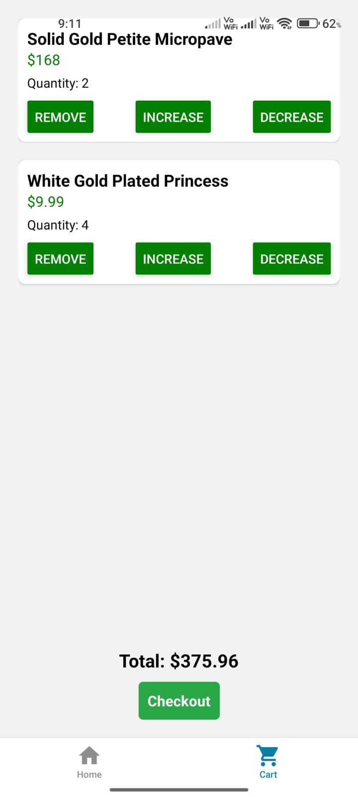

# 🛍️ MiniMart

MiniMart is a simple e-commerce mobile application built using **React Native** and **Expo Router**. It allows users to browse products, view details, add items to a cart, and simulate a checkout process.

---

## 🚀 Features

- 🛒 Browse a list of products
- 🔍 View detailed product information
- ➕ Add/remove items from cart
- 🧾 View total cost and checkout
- 📱 Optimized for both iOS and Android

---

## 📦 Getting Started

Follow these steps to run the app locally.

### 1. Clone the Repository

```bash
git clone https://github.com/Komalkiran085/MiniMart-II.git
cd MiniMart-II
```

### 2. Commands to set up

```bash
npm install
npm install -g expo-cli
npx expo start
```


---

### ✅ **3. Test Instructions (optional, to impress)**

You can include a section like this:

```markdown
## 👨‍💻 How to Test

1. Open the app
2. Browse through products on the Home screen
3. Tap any product to view details
4. Add to cart
5. Navigate to the Cart tab
6. Checkout to simulate purchase
```

## 📸 App Screenshots

### 🏠 Splash Screen


### 📄 List of Products


### 🛒 Product View


### 🛍️ Cart View


### ✅ Order Confirmation


